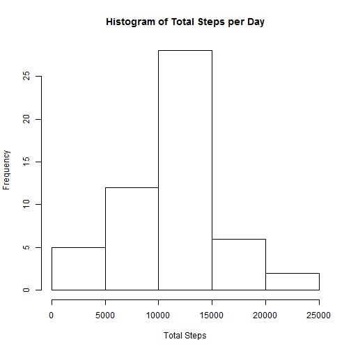
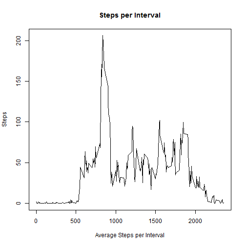
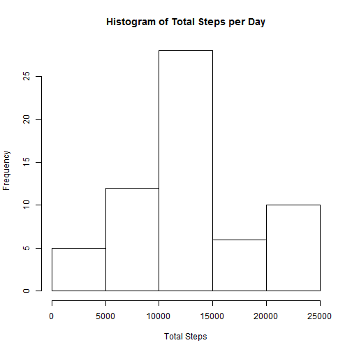
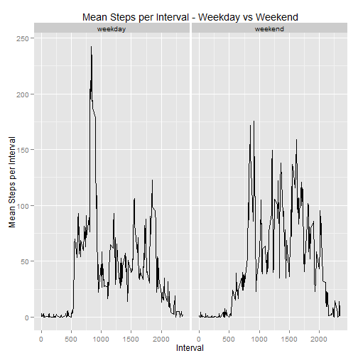

# Reproducible Research: Peer Assessment 1


## Loading and preprocessing the data
First let's load the data and then take a look at it to see if it needs any preprocessing.

```r
setwd("~/Tuvia/Analytics/R_Workspace/5-RepResearch/data")
act <- read.csv("activity.csv", header=T, sep=",")
str(act)
```

```
## 'data.frame':	17568 obs. of  3 variables:
##  $ steps   : int  NA NA NA NA NA NA NA NA NA NA ...
##  $ date    : Factor w/ 61 levels "2012-10-01","2012-10-02",..: 1 1 1 1 1 1 1 1 1 1 ...
##  $ interval: int  0 5 10 15 20 25 30 35 40 45 ...
```
We can see the the "date" is a factor. We'll need to convert it to a date

```r
act$date <- as.Date(as.factor(act$date))
str(act)
```

```
## 'data.frame':	17568 obs. of  3 variables:
##  $ steps   : int  NA NA NA NA NA NA NA NA NA NA ...
##  $ date    : Date, format: "2012-10-01" "2012-10-01" ...
##  $ interval: int  0 5 10 15 20 25 30 35 40 45 ...
```
Now the data is in a format that is usable for data analysis

## What is mean total number of steps taken per day?
First, the original dataset has NA values. For the moment we will just remove those rows and ignore them. Let's remove NA's

```r
library(plyr)
library(ggplot2)
act1 <- act[complete.cases(act),]
str(act1)
```

```
## 'data.frame':	15264 obs. of  3 variables:
##  $ steps   : int  0 0 0 0 0 0 0 0 0 0 ...
##  $ date    : Date, format: "2012-10-02" "2012-10-02" ...
##  $ interval: int  0 5 10 15 20 25 30 35 40 45 ...
```
We now have a dataset with no NA values. Next we need to summarize the data by day. We will calculate the Total steps per day, the Mean and Median values.

```r
act_sum_day <- ddply(act1, .(date), summarize, Total=sum(steps))
Mean <- formatC(mean(act_sum_day$Total),format="f",digits=3, big.mark = ",")
Median <- median(act_sum_day$Total)
summary(act_sum_day )
```

```
##       date                Total      
##  Min.   :2012-10-02   Min.   :   41  
##  1st Qu.:2012-10-16   1st Qu.: 8841  
##  Median :2012-10-29   Median :10765  
##  Mean   :2012-10-30   Mean   :10766  
##  3rd Qu.:2012-11-16   3rd Qu.:13294  
##  Max.   :2012-11-29   Max.   :21194
```
Next let's make a quick Histogram of the Total Steps per Day

```r
hist(act_sum_day$Total, main = "Histogram of Total Steps per Day" , xlab="Total Steps" )
```

 

The Mean number of steps taken per day is 10,766.189 .
The Median number of steps taken per day is 10765.


## What is the average daily activity pattern?

What if we look at the average steps per interval across all days.
First, lets summarize the dataset by interval and calculate the maximum steps taken during any period.


```r
act_avg_day <- ddply(act1, .(interval), summarize, Average=mean(steps))
mday <- subset(act_avg_day,act_avg_day$Average == max(act_avg_day$Average))
```

Now let's have a look at a line plot of this data.


```r
plot(act_avg_day$interval,act_avg_day$Average, type="l",main = "Steps per Interval" , xlab="Average Steps per Interval", ylab="Steps") 
```

 

The interval that contains the maximum number of steps taken per day is 206.1698 during interval 835.  

## Imputing missing values

So now we have to deal with the missing values that we ignored in the oringinal dataset. How many NA values are we dealing with? 

```r
numNA <- sum(is.na(act))
```
This shows the number of NA values is equal to 2304, or approximately 8 days worth of values.
We must devise a method to imput the missing values. We could just use the average for each interval or we could use somethin a little sophisticated, Based of the histogram we made earlier, the data look approximately normally distributed and we have enough data points to make an estimate of the missing values based on the information. The first step is to calculate the mean and standard deviation for each interval.


```r
act_stat_day <- ddply(act1, .(interval), summarize, Total=sum(steps), Mean=mean(steps), StDev=sd(steps))
head(act_stat_day, nrow=5)
```

```
##   interval Total    Mean  StDev
## 1        0    91 1.71698 7.9768
## 2        5    18 0.33962 2.4725
## 3       10     7 0.13208 0.9615
## 4       15     8 0.15094 1.0989
## 5       20     4 0.07547 0.5494
## 6       25   111 2.09434 8.7558
```
Next we take a subset of just the row that are NA, merge this with the Stats that were calculated, add an index and set the NA value to 0. Next the rnorm function was used to generate an integer number of steps greater then 0. Finally a subset of only the columns we started with were merged with the rows dataset the had the NA values removed. This dataset was sorted to the original order.


```r
actNA <- subset(act, is.na(act$steps))
actNA_Stat <- merge(actNA, act_stat_day)
actNA_Stat <- data.frame(index=c(1:nrow(actNA_Stat)),actNA_Stat)
actNA_Stat[is.na(actNA_Stat)] <- 0
for(i in 1:nrow(actNA_Stat)){
  actNA_Stat$steps <- abs(as.integer(rnorm(actNA_Stat$Mean,actNA_Stat$StDev)))
}
str(actNA_Stat)
```

```
## 'data.frame':	2304 obs. of  7 variables:
##  $ index   : int  1 2 3 4 5 6 7 8 9 10 ...
##  $ interval: int  0 0 0 0 0 0 0 0 5 5 ...
##  $ steps   : int  6 6 8 8 8 7 7 7 2 2 ...
##  $ date    : Date, format: "2012-10-01" "2012-11-30" ...
##  $ Total   : int  91 91 91 91 91 91 91 91 18 18 ...
##  $ Mean    : num  1.72 1.72 1.72 1.72 1.72 ...
##  $ StDev   : num  7.98 7.98 7.98 7.98 7.98 ...
```

```r
act_Fixd <- subset(actNA_Stat, select = c(steps,date,interval) )
act2 <- subset(act1, select = c(steps,date,interval) )
fixed_act <- rbind(act_Fixd, act2)
fixed_act <- fixed_act[ order(fixed_act[,2], fixed_act[,3]), ]
fixed_actBYday <- ddply(fixed_act, .(date), summarize, Total=sum(steps))
fmn <- formatC(mean(fixed_actBYday$Total),format="f",digits=3, big.mark = ",")
fmd <- median(fixed_actBYday$Total)
```
A histogram of the data 

```r
hist(fixed_actBYday$Total, main = "Histogram of Total Steps per Day" , xlab="Total Steps" )
```

 

The Mean number of steps taken per day is 12,470.934 .
The Median number of steps taken per day is 11458.
These values are significantly higher then the values from the original, where the mean was 10,766.189 and the median was 10765.


## Are there differences in activity patterns between weekdays and weekends?
For the final part of this analysis we will determine if there is a difference between the steps taken during the weekday vs the weekend.

Lets start be subseting the data into a set for weekend and for weekday. We then summarize the steps per interval and then add back a factor for weekend or weekday. These two datasets can then be put back together with rbind.


```r
fixed_act$weekday <- weekdays(fixed_act$date)
weekend <- c("Saturday","Sunday")
fixed_act_wkend <- subset(fixed_act, fixed_act$weekday %in% weekend)
fixed_act_wkend$weekday <- as.factor(fixed_act_wkend$weekday <- "weekend")
fixed_act_wkend_int <- ddply(fixed_act_wkend, .(interval), summarize, Mean=mean(steps))
fixed_act_wkend_int$dayType <- "weekend"
# Now do the same for the weekday data
fixed_act_wkdy <- subset(fixed_act, !(fixed_act$weekday %in% weekend))
fixed_act_wkdy$weekday <- as.factor(fixed_act_wkdy$weekday <- "weekend")
fixed_act_wkdy_int <- ddply(fixed_act_wkdy, .(interval), summarize, Mean=mean(steps))
fixed_act_wkdy_int$dayType <- "weekday"
fixed_act_factored <- rbind(fixed_act_wkdy_int,fixed_act_wkend_int)

fixed_act_factored$dayType <- as.factor(as.character(fixed_act_factored$dayType))
```

Now lets plot the data to determine the difference


```r
g <- ggplot(fixed_act_factored, aes(interval, Mean))
g + geom_line() +  facet_grid(. ~ dayType) + labs(title = "Mean Steps per Interval - Weekday vs Weekend") +labs(y="Mean Steps per Interval") +labs(x = "Interval")
```

 

It is clear from these plots that the pattern of steps taken during the weekend is significantly differenct for the weekdays. It is possible that this is a source of the increase in the mean and median once the NA values were replaced with rnorm estimate.
 
